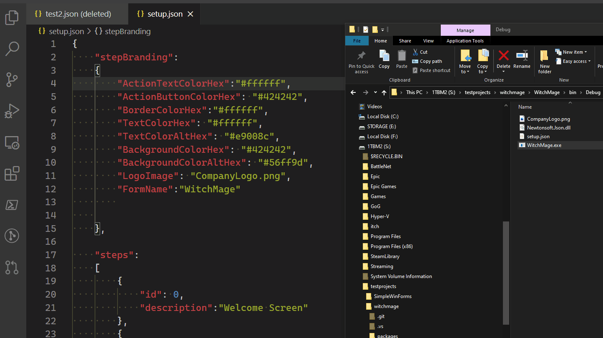

# witchmage
It's kind of like a wizard buy not really! 🧙‍♀️🧙‍🧹🐈

**WitchMage** is a windows utility executable meant to be embedded in other application packages that can be used to quickly and easily generate dynamic, good lookin', and action packed Windows Forms Apps for use as a fully functional wizard, setup launcher, installer, or general windows utility.

#### How it works

Users of witchmage will define a set of desired variables, controls, and behaviors in a simple .JSON file - when the executable is launched, those parameters will be read, and ALL elements of the form with be generated on the fly. This provides users with an easy way to build a dynamic form with some logic components without writing any code or script.

### Capabilities

* Branding - a simple block of JSON will instruct the executable how all elements in the application will appear
* Steps - Your form can have multiple "steps," aka screens or pages. This allows for easy configuration of a multi-page wizard-like application
* Step Components - define a set of components that will appear on each step - this includes many of the popular windows form controls, including: Labels, TextBoxes, Rich Text Boxes, Buttons, Check Boxes, and Images. Many of the standard / most useful parameters of these controls can also be specified for maximum customization!
* Step Actions - actions can be defined so that actions taken in the form can run processes, dynamically enable/disable other elements on the form, change step, open a URL, and more
* step Evaluations - "Evaluations" can be configured that will be processed every second in the background of the form. These evaluations can be configured to execute Step Actions. This allows the form to change based on the environment dynamically. Example: show a checkbox if certain software packages are installed or prevent continuing to the next step if a certain process is still running on the host.